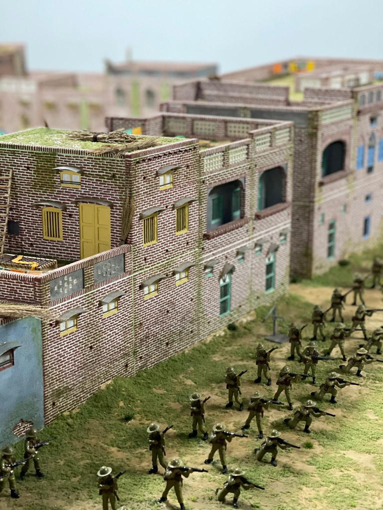

A dedicated section has been created with funding from National Lottery - Heritage Fund. A unique feature of the exhibition is a model of the Jalliawalah Bagh as it was on 13th April 1919. Rather sadly the Indian government / State government have made several modifications to the site which means the ambience of the site has changed considerably. The museum has produced educational materials specifically for schools so that they can use the content as part of the curriculum and to support visits. Special tour can be organised by advance arrangement. We will be organising guest speakers to explore the causes and consequences of this and other massacres in human history.

Educational Materials for Schools can be accessed free of charge from the following link: 
<a href="https://nshchm-s-site.thinkific.com/courses/the-jwb-edu-project">The Jallianwala Bagh Massacre Education Project</a>

    
     
    <strong>Model at National Sikh Museum showing soldiers opening gunfire on protesters at Jallianwala Bagh</strong>

